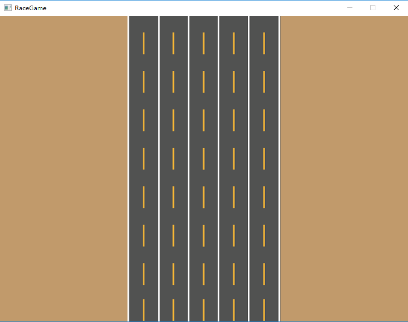
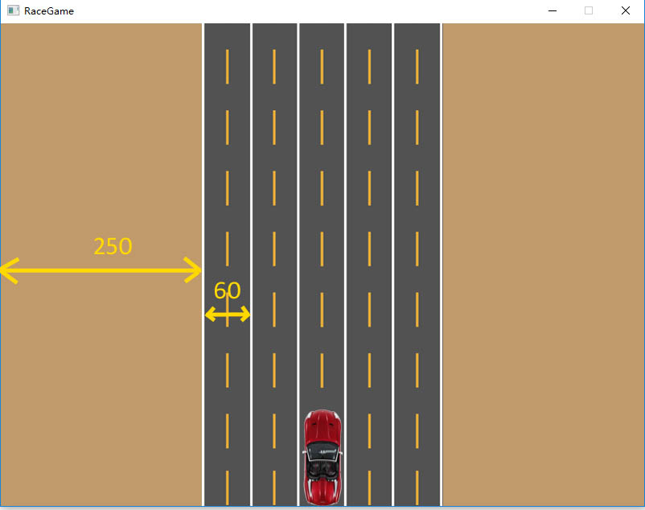
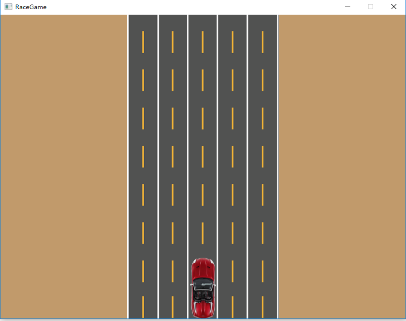

# Iteration1

#### RaceGame v0.01

##### In this iteration, we will create the program and draw the basic images on the window. 

------

- Open your VS Code,  Open your program Folder.

- Create the Window to display our game.

  ```c#
  using System;
  using SplashKitSDK;
  
  public class Program
  {
      public static void Main()
      {
          Window window = new Window("RaceGame", 800, 600);
      }
  }
  ```

- Create a bitmap object using the road image in [resources](files/) 

  ```c#
  Bitmap Road = new Bitmap("Road", "Road1.png");
  ```

- Draw this road bitmap on the window

  ```c#
  window.Clear(Color.RGBColor(193, 154, 107));
  Road.Draw((window.Width-Road.Width)/2, 0);
  window.Refresh();
  ```

  - 1. Clear the window with the color of desert
  - 2. Draw the road bitmap on the middle of window
  - 3. Refresh the window to display any change.

- Now you can switch to the terminal to run your program

  ```powershell
  skm dotnet run	
  ```

  - You can see your program will be shown and disappear in 1 second.

- Use a while loop to keep the window display continuously

  ```c#
  while (!window.CloseRequested)
  {
  	SplashKit.ProcessEvents();
  	window.Clear(Color.RGBColor(193, 154, 107));
  	Road.Draw((window.Width - Road.Width) / 2, 0);
  	window.Refresh();
  }
  window.Close();
  window = null;
  ```

  - Now your program can continuously run until you close the window.

- The program in this step:

- Before we draw the car, we need to calculate the X value for each lane, so we use constants to store these figures: 

  

  ```
  const int LANE_LEFT = 250;
  const int LANE_WIDTH = 60;
  ```

- Create the Player object and draw it 

  ```C#
  Bitmap player = new Bitmap("Player","Playercar1.png");
  
  player.Draw(LANE_LEFT + LANE_WIDTH * 2, window.Height - player.Height);
  //we need to draw the player after we draw the road, because our player is upon the road.
  ```

- The ~~picture~~ program in this Step:

  

------

## [Final Code](code/Iteration1/)
