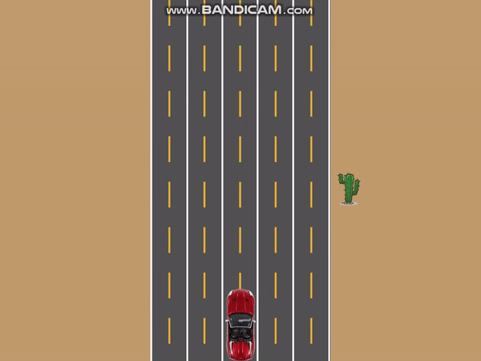

# Iteration2

##### In this iteration, we will let our car "keep moving"

##### It will look like:



------

- Actually, the car is **static**.  we just alternately display the different road images to make the car looks like being moving.

- First, we move our code to a new class `RaceGame`, and just use the program class as an entrance

  ```C#
  public class RaceGame
  {
      ....
  }
  ```

- In `Program` class, we just create a `RaceGame` object and call it do something.

  ```
  public class Program
  {
      public static void Main()
      {
          Window _window = new Window("RaceGame", 800, 800);
          RaceGame _raceGame = new RaceGame();
          
          while (!_window.CloseRequested)
          {
              SplashKit.ProcessEvents();
              _window.Clear(Color.RGBColor(193, 154, 107));
              ...
              _window.Refresh();
          }
          _window.Close();
          _window = null;
      }
  }
  ```

- In `RaceGame` class, declare these fields

  ```C#
  private Window _window;
  private Bitmap _player;
  private Bitmap _road;
  ```

- Add a method to load all images 

  ```C#
  public void LoadResource()
  {
      SplashKit.LoadBitmap("Player1", "PlayerCar1.png");
      SplashKit.LoadBitmap("Road1", "Road1.png");
      SplashKit.LoadBitmap("Road2", "Road2.png");
      SplashKit.LoadBitmap("Road3", "Road3.png");
      SplashKit.LoadBitmap("Cactus", "Cactus.png");
  }
  ```

- Now we write the constructor for `RaceGame` Class. The constructor is a method which will be run automatically when an object of this class is being created. 

- In the constructor, we need to use a parameter to pass in the window object which we create in the `Program` class and reference it to the `_window` field 

  ```
  public class RaceGame
  {
      public RaceGame(Window w)
      {
      	_window = w;
      }
  ```

- Meanwhile, when we create the `RaceGame` object we need to pass this parameter.

  ```
  public class Program
  {
      public static void Main()
      {
          Window _window = new Window("RaceGame", 800, 800);
          RaceGame _raceGame = new RaceGame(_window);
          .....
      }
  }
  ```

- Then call the `LoadResource()` method to load images, and using a `SplashKit` function `SplashKit.BitmapNamed()` to store the image into the variable `_player`.  

  ```
  public class RaceGame
  {
      public RaceGame(Window w)
      {
          _window = w;
          LoadResource();
          _player = SplashKit.BitmapNamed("Player1");
      }
  ```

  To swap the images regularly,  we add new  `Timer`  field to record the time

  ```C#
  private Timer _myTimer;
  ```

- Start recording time since program run (In constructor)

  ```
  _myTimer = new Timer("Timer");
  _myTimer.Start();
  ```

- Add a new method `RoadMove()` for swapping road mages

  - Use  `_myTimer.Ticks` to get the millisecond number

  - Use if statement to check the time and swap the image every 200ms

  ```C#
  public void RoadMove()
  {
      if (_myTimer.Ticks < 200)
      {
      	_road = SplashKit.BitmapNamed("Road1");
      }
      if (_myTimer.Ticks >= 200 && _myTimer.Ticks < 400)
      {
      	_road = SplashKit.BitmapNamed("Road2");
      }
      if (_myTimer.Ticks >= 400 && _myTimer.Ticks < 600)
      {
      	_road = SplashKit.BitmapNamed("Road3");
      }
      if (_myTimer.Ticks >= 600)
      {
      	_myTimer.Start();         //reset time recording
      }
  }
  ```

- Add `Draw()`method and `Move()` method to refresh game and draw bitmap

  ```C#
  public void Draw()
  {
      _road.Draw((_window.Width - _road.Width) / 2, 0);
      _player.Draw(LANE_LEFT + LANE_WIDTH * 2, _window.Height - _player.Height);
  }
  
  public void Move()
  {
      RoadMove();
  }
  ```

- Run your program you will see your car is "moving"

- Now we add the cactus to the roadside to improve our "moving"

  ```c#
  private Bitmap _cactusBitmap;
  //
  _cactusBitmap = SplashKit.BitmapNamed("Cactus");
  ```

- We give a initial position to the cactus in constructor, and change it Y value to make it looks like being moving.

  ```C#
  private double _cactus1X;
  private double _cactus1Y;
  private double _cactus2X;
  private double _cactus2Y;
  public int CactusSpeed = 5;
  
  public RaceGame(Window window)
  {
      .....
      _cactus1X = LANE_LEFT - _cactusBitmap.Width - 5;
      _cactus1Y = 0;
      _cactus2X = LANE_LEFT + LANE_WIDTH * 5 + 5;
      _cactus2Y = -_window.Height / 2;
  }
  
  public void CactusMove()
  {
      _cactus1Y += CactusSpeed;		// make the cactus1 move down
      if (_cactus1Y >= _window.Height)
      {
      	_cactus1Y = 0;    //reset the Y value when it out of screen
      }
      	_cactus2Y += CactusSpeed;	// make the cactus2 move down
      if (_cactus2Y >= _window.Height)	
      {
      	_cactus2Y = 0;	 //reset the Y value when it out of screen
      }
  }
  ```

- Put the method into the `Update()` and then draw them in `Draw()`

  ```c#
  public void Update()
  {
      RoadMove();
      CactusMove();
  }
  
  public void Draw()
  {
      _road.Draw((_window.Width - _road.Width) / 2, 0);
       _player.Draw(LANE_LEFT + LANE_WIDTH * 2, _window.Height - _player.Height);
      _cactusBitmap.Draw(_cactus1X, _cactus1Y);
      _cactusBitmap.Draw(_cactus2X, _cactus2Y);
  }
  ```

------

- In `Program` class, call the `Update()` and `Draw()`

  ```C#
  public static void Main()
  {
      Window _window = new Window("RaceGame", 800, 800);
      RaceGame _raceGame = new RaceGame(_window);
  
      while (!_window.CloseRequested)
      {
          SplashKit.ProcessEvents();
          _window.Clear(Color.RGBColor(193, 154, 107));
          _raceGame.Move();
          _raceGame.Draw();
          _window.Refresh();
      }
      _window.Close();
      _window = null;
  }
  ```


------

## [Final Code](code/Iteration2/)