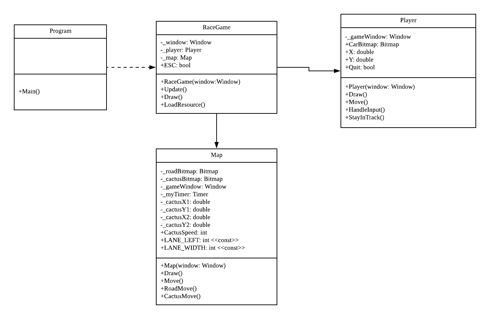

# Iteration3

##### In this iteration, we add the code for controlling our player car and sort our code with more reasonable classification. The UML is 



------

- First, create the `Map` class then put all codes about background into it.

  ```C#
  public class Map
  {
      private Bitmap _roadBitmap;
      //...
     	
      public Map(Window window)
      {
          _cactusBitmap = SplashKit.BitmapNamed("Cactus");
          _gameWindow = window;
          _myTimer = new Timer("timer");
          _myTimer.Start();
          _cactus1X = LANE_LEFT - _cactusBitmap.Width - 5;
          _cactus1Y = 0;
          _cactus2X = LANE_LEFT + LANE_WIDTH * 5 + 5;
          _cactus2Y = -_gameWindow.Height / 2;
      }
      
      public void Draw()
      {
          _roadBitmap.Draw((_gameWindow.Width - _roadBitmap.Width) / 2, 0);
          _cactusBitmap.Draw(_cactus1X, _cactus1Y);
          _cactusBitmap.Draw(_cactus2X, _cactus2Y);
      }
  
      public void Update()
      {
          RoadMove();
          CactusMove();
      }
          
      private void KeepMoving()
      {
          ...
      }
      
      private void CactusMove()
      {
          ...
      }
  }
  ```

  

- Create the `Player` class and move the codes about player into it

  ```C#
  public class Player
  {
      private Window _gameWindow;
      public Bitmap _CarBitmap;
  	
      public double X;
      public double Y;
  	// To control our player car,we need the X and Y value to change its position  
  }
  ```

- In the `Player()` constructor, we give it a initial position

  ```C#
  public Player(Window window)
  {
      CarBitmap = SplashKit.BitmapNamed("Player1");
      _gameWindow = window;
      X = Map.LANE_LEFT + Map.LANE_WIDTH * 2;
      Y = _gameWindow.Height - CarBitmap.Height;
  }
  ```

- Write a `HandleInput()` method to read the user input

  ```C#
  public void HandleInput()
  {
      int movement = Map.LANE_WIDTH;
      int speed = 4;
      if (SplashKit.KeyReleased(KeyCode.RightKey) || SplashKit.KeyReleased(KeyCode.DKey))
      {
          X += movement;
      }
      if (SplashKit.KeyReleased(KeyCode.LeftKey) || SplashKit.KeyReleased(KeyCode.AKey))
      {
          X -= movement;
      }
      if (SplashKit.KeyDown(KeyCode.UpKey) || SplashKit.KeyDown(KeyCode.WKey))
      {
          Y -= speed;
      }
      if (SplashKit.KeyDown(KeyCode.DownKey) || SplashKit.KeyDown(KeyCode.SKey))
      {
          Y += speed;
      }
  }
  ```

  - We change the X and Y values to make it move.

- Add the `Move()` method and `Draw()` method

  ```C#
  public void Move()
  {
      HandleInput();
  }
  
  public void Draw()
  {
      CarBitmap.Draw(X, Y);
  }
  ```

- We want to add a exit function, when user press the ESC Key, to close the program.

- Add a bool value to detect the user input

  ```C#
  public bool Quit { get; set; }
  //...
  
  if (SplashKit.KeyReleased(KeyCode.EscapeKey))
      {
          Quit = true;
      }
  ```

- Also, in `RaceGame` Class add a `ESC` property

  ```C#
  public bool ESC
  {
      get
      {
          return _player.Quit;
      }
  }
  ```

- Create the `_player` and `_map` object in `RaceGame` class and use the method `Update()`  and `Draw()`  to call them 

  ```
  private Player _player;
  private Map _map;
  
  public RaceGame(Window w)
  {
      _window = w;
      LoadResource();
      _player = new Player(_window);
      _map = new Map(_window);
  }
  
  public void Update()
  {
      _player.Move();
      _map.Move();
  }
  
  public void Draw()
  {
      _map.Draw();
      _player.Draw();
  }
  ```

- Change the loop condition in `Program` class,  also call the `_raceGame` object to `Update()` and `Draw()`

  ```C#
  while (!_window.CloseRequested && !_raceGame.ESC)
  {
      SplashKit.ProcessEvents();
      _window.Clear(Color.RGBColor(193, 154, 107));
      _raceGame.Update();
      _raceGame.Draw();
      _window.Refresh();
  }
  ```

- Run your program, we could control our car to move.

- However, the car can be out of the track even out of the screen

- Now we add the `StayInTrack()` method to limit it

  ```C#
  private void StayInTrack()
  {
      if (X >= Map.LANE_LEFT + Map.LANE_WIDTH * 5) //the right side of track
      {
          X -= Map.LANE_WIDTH;
      }
      if (X < Map.LANE_LEFT) //the left side of track
      {
          X += Map.LANE_WIDTH;
      }
      if (Y > _gameWindow.Height - CarBitmap.Height)
      {
          Y = _gameWindow.Height - CarBitmap.Height;
      }
      if (Y < 0)
      {
          Y = 0;
      }
  }
  ```

- Finally, put the `StayInTrack()`into the `Move()` method

------

# [Final Code](code/Iteration3/)


