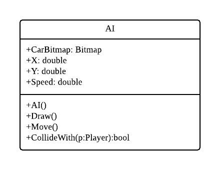
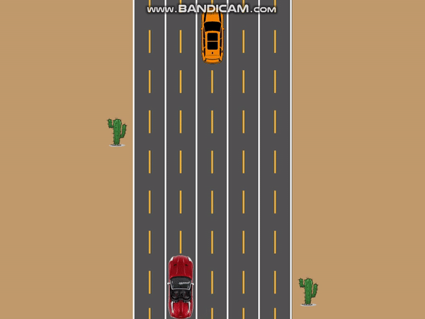
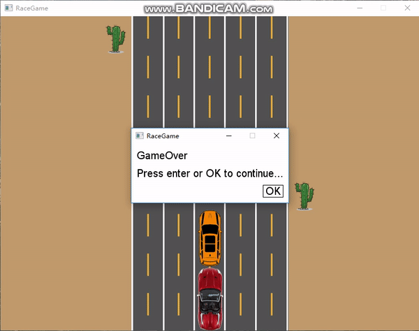

# Iteration4

##### In this Iteration, we would like to add a AI car, and we need to control our car to dodge it.

##### The AI class UML should be:



------

- Create the `AI` class. Similar to the cactus, we declare the bitmap, X, Y, and make it move

  ```C#
  public class AI
  {
      public Bitmap CarBitmap;
      public double X;
      public double Y;
      public double Speed = 3;
      
      public AI()
      {
          CarBitmap = SplashKit.BitmapNamed("AICar1");
          //Load bitmap resources in LoadResource()
          X = Map.LANE_LEFT + Map.LANE_WIDTH * 2;
          Y = -CarBitmap.Height;
      }
  
      public void Draw()
      {
          CarBitmap.Draw(X,Y);
      }
  
      public void Move()
      {
          Y += Speed;
      }
  }
  ```

  

- Update the `RaceGame` Class, create the `AI` object and call it `move()` and `draw()`,then run your program, you have a moving AI car like this:



- Now we use `SplashKit` function to write a method to detect the collision and return a bool value

  ```C#
  public bool ColliedWith(Player p)
  {
      return CarBitmap.BitmapCollision(X, Y, p.CarBitmap, p.X, p.Y);
  }
  ```

- Add a `Collision()`method in `RaceGame` class. When our player collide with the AI car, the game will be reset.

  - We could use  `SplashKit` to show a message box but we should load the font which is in the [Resource](files/) files

  ```C#
  public void LoadResource()
  {	
  	SplashKit.LoadFont("FontC", "calibri.ttf"); 
  }
  ```

  - Add a bool value `Restart`  assign it in the `Collision()`

  ```C#
  public bool Restart;
  
  public void Collision()
  {
      if (_ai.ColliedWith(_player))
      {
          SplashKit.DisplayDialog("GameOver", "GameOver", SplashKit.FontNamed("FontC"), 20);
          Restart = true;
      }
  }
  ```

  - use the `Restart` value in `Program` class to reset game

  ```C#
  while (!_window.CloseRequested && !_raceGame.ESC)
  {
      if (_raceGame.Restart)
      {
          _raceGame = new RaceGame(_window);
      }
      ...
  }
  ```

- Put the `Collision()` into `Update()` then run your program, it will look like

  

------

## [Final Code](code/Iteration4)